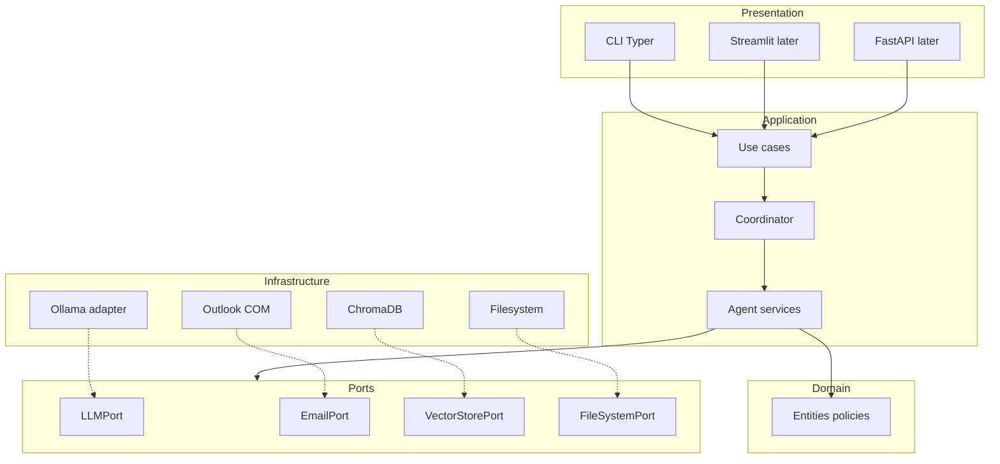

# Prometheus

Lokaal gehost, privacy-first **agentic AI** op Windows: Ollama als LLM, een **coordinator** die taken routeert, en gespecialiseerde agents voor **mail** (Outlook COM), **leerstof** (RAG) en **administratie** (mappen, PDF-vakken). Geen cloud-LLM voor gevoelige data; optionele online tools alleen met expliciete policy.

**Repository:** https://github.com/jensbaetens-odisee/Prometheus

---

## Snel starten (software installeren)

### Automatisch (aanbevolen)

Vanuit de projectmap, in **Windows PowerShell** of PowerShell 7:

```powershell
powershell -ExecutionPolicy Bypass -File .\scripts\install-prerequisites.ps1
```

> **PowerShell 5.1:** de operator `&&` werkt niet. Keten commando's met `;` of op aparte regels (het install-script gebruikt daarom `winget` voor uv).

Het script controleert en installeert waar mogelijk:

| Software | Doel | Installatie |
|----------|------|-------------|
| **Git** | Versiebeheer | `winget` indien ontbreekt |
| **Python 3.12+** | Runtime | `winget` indien ontbreekt |
| **uv** | Dependencies, `uv run` | `winget install astral-sh.uv` of `pip install uv` (PS 5.1); anders [install.ps1](https://astral.sh/uv/install.ps1) (PS 7+) |
| **Ollama** | Lokale LLM + embeddings | `winget install Ollama.Ollama` |
| **Outlook desktop** | Mail-agent (COM) | Handmatig / Office — niet via script |

Optioneel worden Ollama-modellen voorgesteld: `llama3.1:8b`, `llama3.2:3b`, `nomic-embed-text`.

### Handmatig

- **uv (PS 5.1):** `winget install --id astral-sh.uv -e` of `py -m pip install uv`
- **uv (PS 7+):** `irm https://astral.sh/uv/install.ps1 | iex`
- **Ollama:** https://ollama.com/download/windows — daarna `ollama pull llama3.1:8b` en `ollama pull nomic-embed-text`
- **pywin32** (later, via project): komt in `pyproject.toml`, alleen Windows

**Fase 0** — project installeren en CLI:

```powershell
# met uv (aanbevolen)
uv sync --extra dev
uv run local-agents --help

# of met pip
py -m pip install -e ".[dev]"
py -m local_agents.presentation.cli --help
```

Voorbeelden:

```powershell
uv run local-agents --fake-llm ask "Vraag over leerstof"
uv run local-agents study index ./data/courseware/fysica --name fysica
uv run local-agents study ask "Wat is kinetische energie?" --course fysica
uv run local-agents study repl --course fysica
uv run local-agents tools
uv run local-agents read-file data/voorbeeld.txt
py -m pytest
```

**Study-agent:** indexeer PDF/txt/md uit een map, daarna vragen met bronnen (lokaal via Ollama + Chroma onder `data/chroma`).

---

## Kernkeuzes

1. **Mail via Outlook COM (`pywin32`)** — geen Azure app registration / Microsoft Graph.
2. **CLI-first** — later dezelfde use cases in Streamlit of een web-UI.
3. **Clean architecture** — domain → application (ports + use cases) → infrastructure (adapters) → presentation; businesslogica unit-testbaar met fakes.

---

## Doelarchitectuur



**Regel:** presentatie roept alleen use cases aan. Geen `win32com`, HTTP of Chroma in CLI/agent-logica.

---

## Hardware (richtlijn)

| Component | Minimum | Aanbevolen |
|-----------|---------|------------|
| RAM | 16 GB | 32 GB+ |
| GPU | Optioneel | NVIDIA 8–12 GB VRAM+ |
| Schijf | ~20 GB vrij | SSD voor modellen + vector DB |

**Ollama-modellen (start):**

- Coordinator / algemeen: `llama3.1:8b` of `qwen2.5:7b`
- Snelle routing: `llama3.2:3b`
- Embeddings (RAG): `nomic-embed-text`

---

## Geplande projectstructuur

```
Prometheus/
├── pyproject.toml
├── config/
│   ├── default.yaml
│   └── agents.yaml
├── src/local_agents/
│   ├── domain/
│   ├── application/
│   │   ├── ports/
│   │   ├── use_cases/
│   │   ├── coordinator/
│   │   └── agents/
│   ├── infrastructure/
│   │   ├── llm/ollama_adapter.py
│   │   ├── email/outlook_com_adapter.py
│   │   ├── vector/chroma_adapter.py
│   │   ├── filesystem/local_adapter.py
│   │   └── di/container.py
│   ├── presentation/
│   │   ├── cli/
│   │   ├── streamlit/
│   │   └── web/
│   ├── tools/
│   └── skills/
├── scripts/
│   └── install-prerequisites.ps1
├── data/                 # niet in git
├── tests/
└── .env.example
```

**Dependency rule:**

- `domain` → importeert niets externs
- `application` → alleen `domain` + `ports`
- `infrastructure` → implementeert `ports`
- `presentation` → alleen `application` + DI container

**DI:** `AppContainer` in `infrastructure/di/container.py` — één composition root voor CLI, Streamlit en web.

---

## Coordinator

1. Intent classificatie (mail, leerstof, admin)
2. Agent-delegatie (enkel of sequentie)
3. Privacy policy per tool: `local_only` | `online_allowed` | `requires_approval`
4. Human-in-the-loop (drafts, destructieve acties)
5. Korte sessie-context lokaal
6. Audit log

---

## Agents

### Mail-agent (Outlook COM)

- **Geen** Microsoft Graph / app registration.
- `EmailPort` + `OutlookComAdapter` (`win32com.client.Dispatch("Outlook.Application")`).
- Draft-only in v1; verzenden alleen via goedkeuring (`SendApprovedDraft`).
- COM op main thread of dedicated STA-worker.
- Tests: `FakeEmailPort`; integratie `@pytest.mark.outlook` lokaal.

### Study-agent (RAG)

- Ingest: PDF, DOCX, PPTX, Markdown → chunking → lokale embeddings (Ollama).
- Vector DB: ChromaDB of LanceDB onder `data/courseware/`.
- Antwoorden met **bronvermelding**; alles lokaal.

### Admin-agent

- PDF → vaknamen → mappen onder allowlist-root (bijv. OneDrive-syncmap).
- Idempotent; bevestiging vóór aanmaken.
- Optioneel daarna `IndexCourseware` voor die map.

---

## Skills / tools (uitbreidbaar)

MCP-achtig patroon:

- `skills/<naam>/SKILL.md` — wanneer de agent de skill gebruikt
- `skills/<naam>/tools.py` — registratie bij startup
- `config/agents.yaml` — welke agent welke skills mag laden

`Tool` protocol: `name`, `description`, Pydantic-parameters, `execute()`, `privacy_level`.

---

## CLI (MVP)

Entrypoint (na implementatie): `uv run local-agents`

| Commando | Use case |
|----------|----------|
| `study index <pad>` | `IndexCourseware` |
| `study ask "<vraag>"` | `AskStudyQuestion` (`--course`) |
| `study repl` | Interactieve sessie |
| `mail list` | `ListUnreadEmails` |
| `mail draft <id>` | `DraftEmailReply` |
| `mail approve <draft-id>` | `SendApprovedDraft` |
| `admin folders <pdf>` | `CreateSubjectFolders` |
| `ask "<vraag>"` | Coordinator routing |

**Study-flow:** eerst `study index`, dan `study ask` met bronnen in de output.

---

## Privacy (default)

```yaml
privacy:
  default_level: local_only
  allow_online_tools: false
  require_approval_for: [send_email, delete_path, online_search]
```

Optioneel later: DuckDuckGo/SearXNG, Tesseract OCR — nooit leerstof/mail zonder policy.

---

## Ontwikkelstack

- **uv** + **pyproject.toml**
- **Ruff**, **Black**, **mypy**
- **pytest:** unit (fakes), adapter (`@pytest.mark.ollama`), Outlook (`@pytest.mark.outlook`, skipped in CI)

---

## Roadmap

| Fase | Inhoud |
|------|--------|
| **0** | Lagen, ports, DI, CLI skeleton, `OllamaAdapter`, `FakeLLMPort`, tool registry |
| **1** | Study-agent: RAG, Chroma, `study index/ask/repl` |
| **2** | Admin-agent: PDF-vakken, mappen + confirm |
| **3** | Mail-agent: `OutlookComAdapter`, draft/approve |
| **4** | Coordinator `ask`, skill loader |
| **5** | Streamlit of FastAPI (zelfde `AppContainer`) |
| **6** | Optionele online tools |

**Huidige status:** **Fase 1** afgerond (study-agent, RAG, Chroma, CLI `study index/ask/repl`). Fase 2 (admin) volgt.

---

## Checklist vóór development

- [ ] `.\scripts\install-prerequisites.ps1` gedraaid
- [ ] Ollama bereikbaar (`ollama list`)
- [ ] Outlook desktop + ingelogd account
- [ ] Root-map voor schoolbestanden gekozen
- [ ] Privacy/goedkeuringsregels akkoord (geen auto-send mail)

---

## Risico's

| Risico | Mitigatie |
|--------|-----------|
| Klein model + tool-calling | Router-model + strikte JSON-schema's |
| Traag op CPU | Klein router-model; `q4_K_M` quant |
| Outlook COM fragiel | Dedicated adapter; duidelijke fouten; Outlook open |
| New vs klassiek Outlook | Test op jouw setup; v1 mogelijk alleen klassiek |
| RAG hallucinaties | Verplichte bronnen; “onvoldoende context” |
| Per ongeluk mail verstuurd | Draft-only + `approve_send` |

---

## Licentie

Nog te bepalen.
